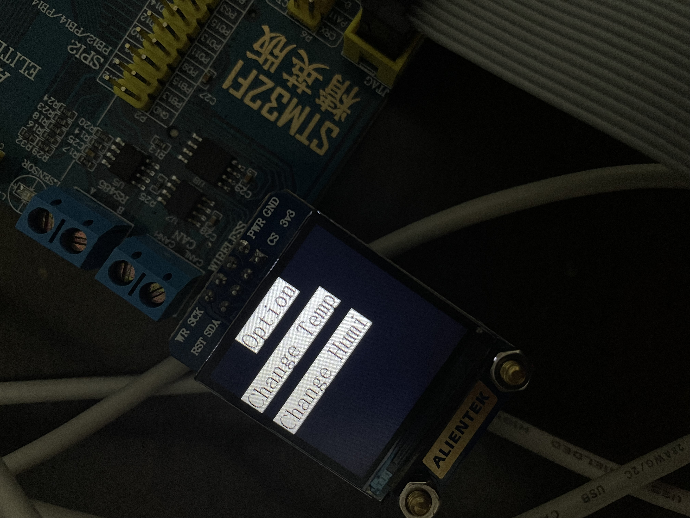
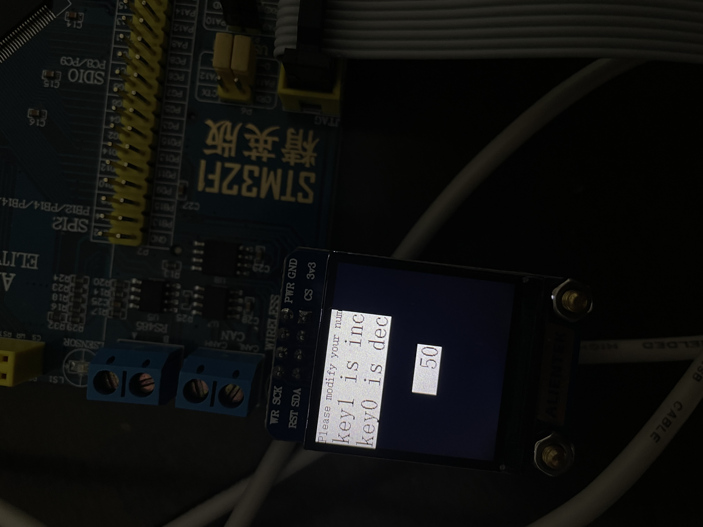
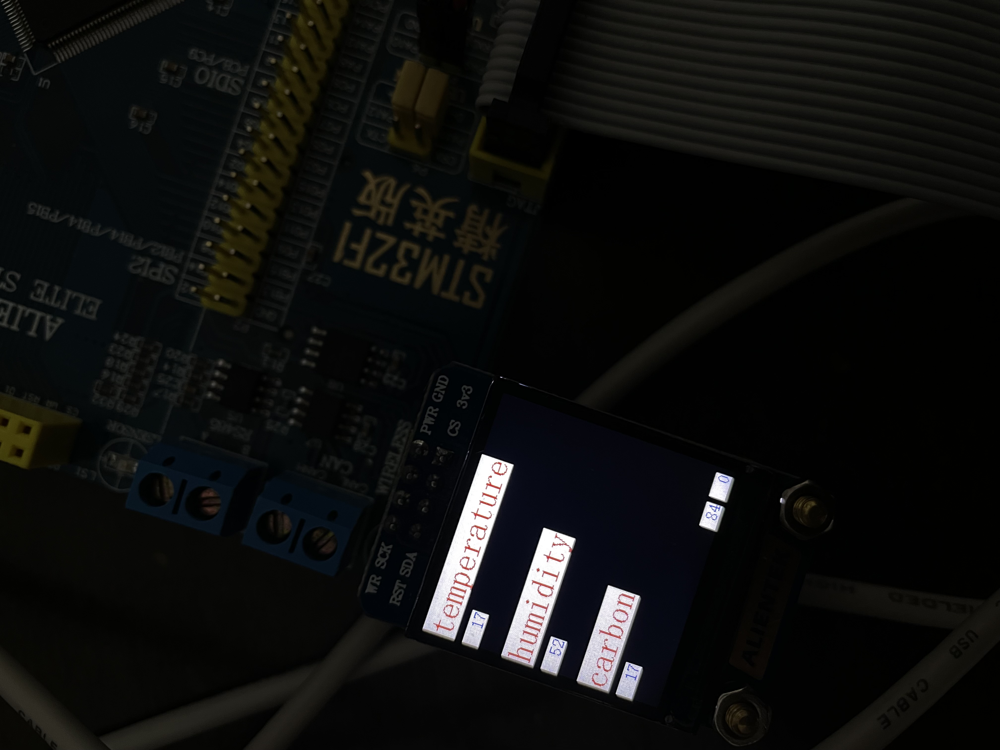
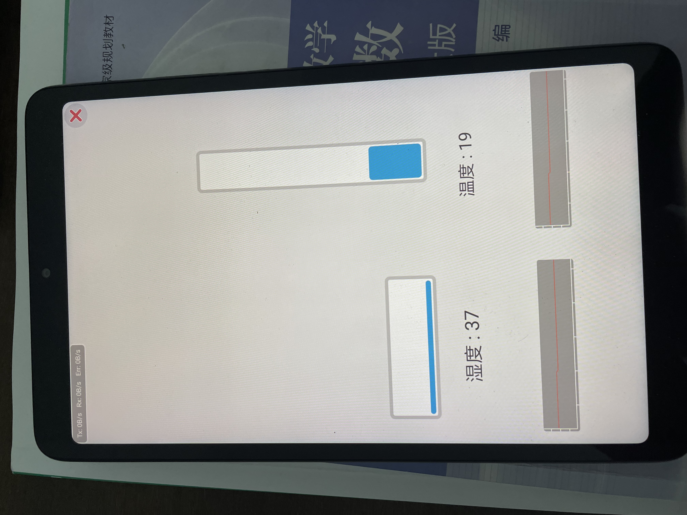
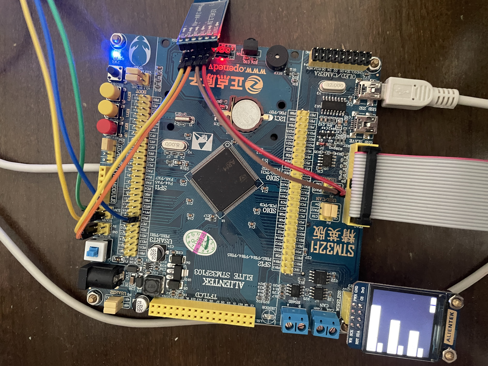

# 项目名称
基于STM32的车内温湿度检测系统 
Temperature and humidity detection system based on STM32

# 文件夹介绍
1. FWLIB 标准库函数模块代码
1. CORE 芯片驱动代码
1. SYSTEM 标准库函数代码
1. BUILD Vscode & keil & arm tool chain相关文件
1. DOC 部分论文以及文档
1. USER 自定义代码
1. HARDWARE STM32硬件部分相关代码
1. MODULE 除去芯片主体部分, 模块相关代码

# 选材
1. 主控芯片 `STM32F103ZET6`
2. 温湿度检测模块 `DHT-11`
3. 图形模块 `TFTLCD`
4. 蓝牙模块 `HC-05`

# 接线
| 线路名称   | 引脚位置 |
|------------|----------|
| DHT11_data | PG0      |
| TFTLCD_PWR | PG8      |
| TFTLCD_RST | PG6      |
| TFTLCD_WR  | PB14     |
| TFTLCD_CS  | PG7      |
| HC05_RXD   | PA10     |
| HC05_TXD   | PA9      |
| SGP30_SDA  |          |
| SGP30_SCL  |          |

# 简介
&emsp;&emsp;本项目采用了正点原子的`STM32F103ZET6`开发板, 利用SPI总线协议连接`TFTLCD`模块. 
&emsp;&emsp;`HC05`蓝牙模块的`TXD`连接单片机`USART_RXD`, `RXD`连接单片机的`USART_TXD`. 通过串口协议使得手机APP端能够与单片机通信 
&emsp;&emsp;`DHT11`通过单总线通信协议与单片机相连, `DHT11`的`DATA`引脚连接单片机的`PG0`口 

# Feature
&emsp;&emsp;本项目使用到了`usart`中断, 中断类型为`usart_itfalg_rxne`, 串口接收到数据的时候进入中断. 通过判断串口接受的数据从而做出不同的回应. 
&emsp;&emsp;本项目使用了`time`中断, 中断类型为`time_itfalg_update`, 当定时器val寄存器为0的时候进入中断, 同时发送一串数据包, 数据包的格式如下
>数据包包头: 0X5A 数据包包尾: 0XA5 数据包数据1: 8位湿度数据 数据包数据2: 8位温度数据 数据包校验位: 数据包数据1 + 数据包数据2

&emsp;&emsp;本项目采用了`EXTI`中断进入三级菜单, 通过TFTLCD与单片机相连, 使得单片机与操作者之间有一定的人机交互功能, TFTLCD中有三级菜单, 通过KEY_UP可以进入EXTI中断从而进入菜单. 进入菜单后可以对DHT11的温度阈值以及湿度阈值做出一定的控制 

# TODO

- [x] HC-05蓝牙模块
- [x] DHT11温湿度模块
- [x] TFTLCD模块
- [x] 交互系统

